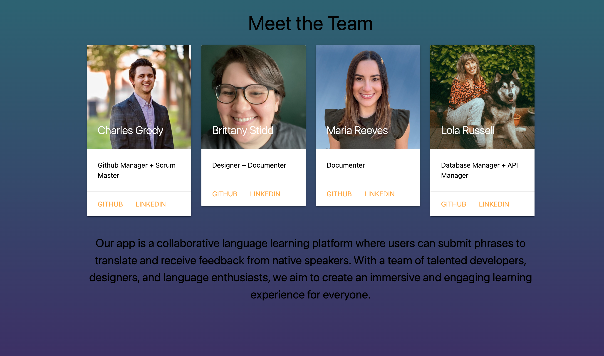
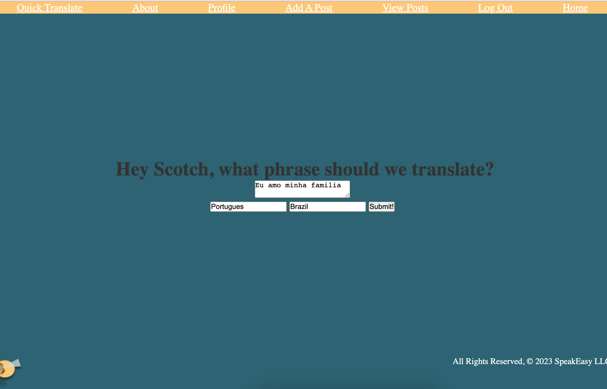
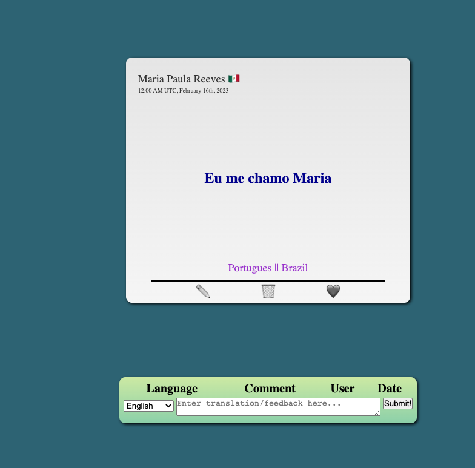
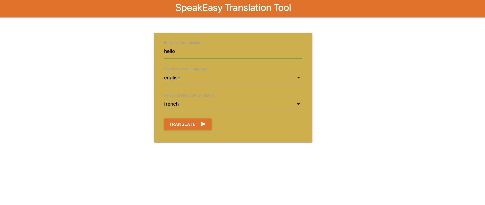
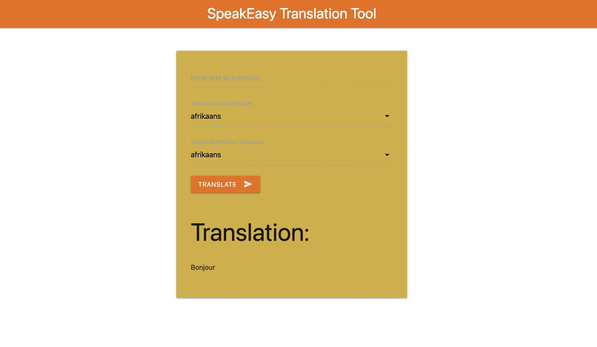

# SpeakEasy

## Overview: 

---

Welcome to Speakeasy,

 The community language app where you can share and learn new phrases in your native language. Connect with language enthusiasts from around the world and receive feedback on your posts to improve your skills.

On Speakeasy, you can create a profile page to save your favorite posts and track your progress. Add a profile picture to personalize your account and share your interests with the community.

Join our community today and start sharing your love of language with the world on Speakeasy.

---

## Screenshot(s):

---
## Technologies Used:

* Python
* Django
* PostgreSQL
* HTML5
* CSS3
* Bootstrap
* Boto3
* Google Translate API (not currently functional)

---

## Trello

https://trello.com/b/Ztcok7Fi/project-3-speakeasy

--- 

## Getting Started:

[link here ]

---

## Stretch Goals:

* Improve the functionality of the auto-translate API
* Enhance the design and user interface
* Allow users to personalize their profiles
* Enable adding pictures to posts

